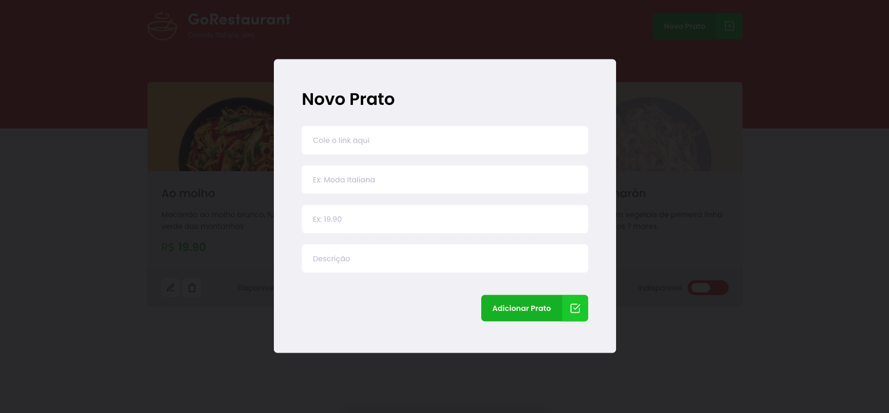

<p>
    
</p>

<p>
    
</p>


# :rocket: Technologies
This project was made using the follow technologies:

* [Typescript](https://www.typescriptlang.org/)      
* [React](https://reactjs.org/)      
* [Styled Components](https://styled-components.com/)
* [MirageJS](https://miragejs.com/)


# :computer: How to run

```bash
# Clone Repository
$ git clone https://github.com/rakelmm/ignite-reactjs-refactoring-classes-ts.git
```

```bash
# Install Dependencies
$ yarn
# Run Aplication
$ yarn start
# Run server
$ yarn server
# Go to
$ http://localhost:3000/
```
---

Feito com ❤️ por Rakel Moreira.
